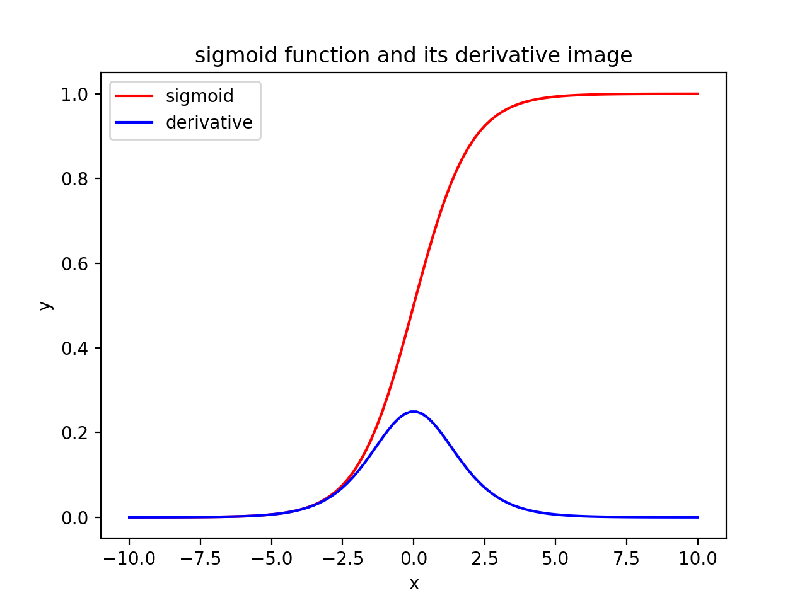
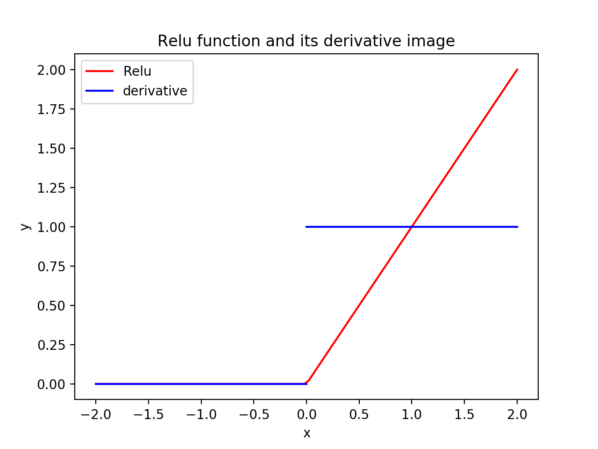
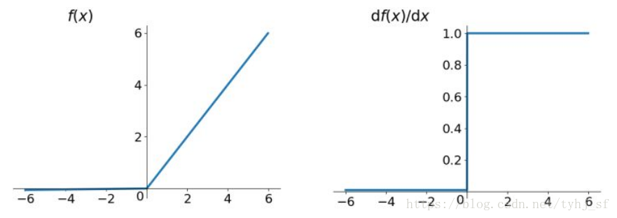
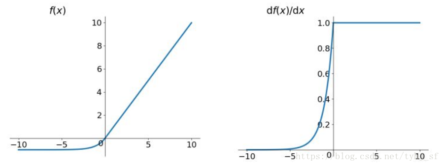

# 机器学习-激活函数总结

## 0x1 为什么要引入激活函数

如果没有激活函数，那么每一层其实本质上就是一个线性函数，与没有隐藏层效果相当，这样就与最原始的感知机一样了，这样带来的一个最严重的问题就是网络的**表达能力**（也可以理解为逼近的能力）十分有限， **无法解决线性不可分的问题**。

正是因为线性函数的网络表达能力有限，所以引入了**非线性函数**作为激励函数，这样深层次的神经网络模型表达能力就会更加强大。（这样不再是简单的线性组合，而是基本上可以拟合或逼近任意函数），**非线形的激活函数就能够解决线性不可分的问题了**。

## 0x2 为什么引入Relu

1. 采用sigmoid等函数，算激活函数时（指数运算），**计算量大**，反向传播求误差梯度时，求导涉及除法，计算量相对大，而采用Relu激活函数，整个过程的计算量节省很多。

2. 对于深层网络，sigmoid函数反向传播时，很容易就会出现**梯度消失**的情况（在sigmoid接近饱和区时，变换太缓慢，导数趋于0，这种情况会造成信息丢失，答案的第三点），从而无法完成深层网络的训练。

3. Relu会使一部分神经元的输出为0，这样就造成了网络的**稀疏性**，并且减少了参数的相互依存关系，缓解了过拟合问题的发生（以及一些人的生物解释balabala）。

   

## 0x3 sigmoid激活函数

sigmoid常用的非线性激活函数，公式为：$f(x) = \frac{1}{1+e^{-x}}$

sidmoid函数图像和导函数图像如下：

特点：它能够把输入的连续实值变换为0和1之间的输出，特别的，如果是非常大的负数，那么输出就是0；如果是非常大的正数，输出就是1.

缺点1. 在深度神经网络中梯度反向传递时导致**梯度爆炸和梯度消失**，其中梯度爆炸发生的概率非常小，而梯度消失发生的概率比较大。如果我们初始化神经网络的权值为、[0,1]之间的随机值，由反向传播算法的数学推导可知，梯度从后向前传播时，每传递一层梯度值都会减小为原来的0.25倍，如果神经网络隐层特别多，那么梯度在穿过多层后将变得非常小接近于0，即出现梯度消失现象；当网络权值初始化为 (1,+∞) 区间内的值，则会出现梯度爆炸情况。**x很大的时候，y的值区别不是很大，就会出现梯度消失的问题。**

缺点2. **Sigmoid 的 output 不是0均值**（即zero-centered）。这是不可取的，因为这会导致后一层的神经元将得到上一层输出的非0均值的信号作为输入。 产生的一个结果就是：如x>0,$f = w^Tx + b$,那么对w求局部梯度则都为正，这样在反向传播的过程中w要么都往正方向更新，要么都往负方向更新，导致有一种捆绑的效果，使得收敛缓慢。 当然了，如果按batch去训练，那么那个batch可能得到不同的信号，所以这个问题还是可以缓解一下的。因此，非0均值这个问题虽然会产生一些不好的影响，不过跟上面提到的梯度消失问题相比还是要好很多的。

缺点3. 其解析式中含有幂运算，计算机求解时相对来讲比较耗时。对于规模比较大的深度网络，这会较大地增**加训练时间**。

## 0x4 tanh激活函数

tanh激活函数为：$tanh(x) = \frac{e^x - e^{-x}}{e^x + e^{-x}}$

tanh函数图像和导函数图像如下：

tanh读作Hyperbolic Tangent，**它解决了Sigmoid函数的不是zero-centered输出问题**

然而，**梯度消失（gradient vanishing）的问题和幂运算的**问题仍然存在。

## 0x5 ReLU激活函数

Relu激活函数为：$Relu = max(0, x)$

Relu函数图像和导函数图像如下：

 

Relu激活函数的优点：

1. 在正区间内解决了梯度消失的问题。
2. 计算速度很快，只需要判断输入是否大于0
3. 收敛速度远快于sigmoid和tanh。

Relu激活函数的问题：

1. ReLU的输出不是zero-centered

2. Dead ReLU Problem，指的是**某些神经元可能永远不会被激活**，导致相应的参数永远不能被更新。有两个主要原因可能导致这种情况产生: (1) **非常不幸的参数初始化**，这种情况比较少见 (2) **learning rate太高**导致在训练过程中参数更新太大，不幸使网络进入这种状态。解决方法是可以采用Xavier初始化方法，以及避免将learning rate设置太大或使用adagrad等自动调节learning rate的算法。

   尽管存在这两个问题，ReLU目前仍是最常用的activation function，在搭建人工神经网络的时候推荐优先尝试！

## 0x6 PReLU激活函数

PReLU是Leaky ReLU的一个变体，叫做**参数化修正线性单元**，函数表达式为：$f(x) = max(\alpha x, x)$

PRelu函数图像和导函数图像如下：在下左图的左边部分，其斜率$\alpha$是一个非常小的值，接近于0，所以看起来像平的。

PRelu激活函数的优点：

**解决了ReLU某些神经元无法被激活的问题。**

## 0x7 RReLU激活函数

RReLu也是Leaky ReLU的一个变体，叫做**随机修正线性单元**，激活函数的表达式为：
$$
y_{ji}
\begin{cases}
x_{ji}, &if\ x_{ji}\ \ge \ 0\\
x_{ji}x_{ji}, &otherwise
\end{cases}

where \ a_{ji}\sim\ U(l,u), l < u \ and\ l\ ,u \in[0,1]
$$
ReLU、ReLU、PReLU、RReLU的对比图如下：

1. PReLU中的ai是根据数据变化的；
2. Leaky ReLU中的ai是固定的
3. RReLU中的aji是一个在一个给定的范围内随机抽取的值，这个值在测试环节就会固定下来。

## 0x8 ELUs激活函数

ELUs（Exponential Linear Units）激活函数的表达式为：
$$
f(x)
\begin{cases}
x, &if\ x\  >\ 0\\
\alpha(e^x - 1), &otherwise
\end{cases}
$$
ELUs函数图像和导函数图像如下

ELUs基本具备ReLu的所有优点，以及：

1. 不会有Dead ReLu的问题
2. 输出的均值接近于0, zero-centered

## 0x9 Maxout激活函数

Maxout是深度学习网络中的一层网络，就像池化层、卷积层一样等，我们可以把maxout 看成是网络的激活函数层，我们假设网络某一层的输入特征向量为：X=（x1,x2,……xd），也就是我们输入是d个神经元

maxout计算公式为：$h_i(x) = \max_{j\in[i, k]} z_{ij}$

其中：$z_{ij} = x^TW_{...ij} + b_{ij}$

## 0x10 如何选择激活函数

1. 深度学习往往需要大量时间来处理大量数据，模型的收敛速度是尤为重要的。所以，总体上来讲，训练深度学习网络**尽量使用zero-centered**数据 (可以经过数据预处理实现) 和zero-centered输出。所以要尽量选择输出具有zero-centered特点的激活函数以加快模型的收敛速度。
2. 如果使用 ReLU，那么一定要小**心设置 learning rate**，而且要注意不要让网络出现很多 “dead” 神经元，如果这个问题不好解决，那么可以试试 Leaky ReLU、PReLU 或者 Maxout.
3. **最好不要用 sigmoid，你可以试试 tanh**，不过可以预期它的效果会比不上 ReLU 和 Maxout.

## 0x11 激活函数总结

| 激活函数 | 优点                                                         | 缺点                                                         | 备注           |
| :------: | :----------------------------------------------------------- | :----------------------------------------------------------- | -------------- |
| sigmoid  | 1. 便于求导的平滑函数 2. 能压缩数据，保证数据幅度 3.适合相前传播 | 1. 梯度消失 2.输出不是0均值 3.幂运算耗时           | 饱和激活函数   |
|   tanh   | 1. 解决了sigmoid的输出不是0均值的问题                        | 1.梯度消失 2.幂运算耗时                                 | 饱和激活函数   |
|   ReLU   | 1. 速度快 2.计算复杂度低 3.适用于向后传播          | 1. 输出不是0均值 2.神经元坏死现象 3. ReLU不会对数据进行压缩 | 非饱和激活函数 |
|  PReLU   | 1. 解决了神经元坏死(Dead ReLU)现象                           |                                                              | 非饱和激活函数 |
|  RReLU   |                                                              |                                                              | 非饱和激活函数 |
|   ELUs   | 1. 有ReLU的所有优点 2.不存在神经元坏死(Dead ReLU)现象 3.输出为0均值 | 1.计算量大                                                   | 非饱和激活函数 |
|  maxout  | 1. 具有ReLU的所有优点，线性、不饱和性。 2.不存在神经元坏死(Dead ReLU)现象 | 1. 参数量巨大                                                | 非饱和激活函数 |

非饱和激活函数优点：**能解决梯度消失问题，收敛速度快**。

参考1：https://blog.csdn.net/weixin_43077261/article/details/97285284

参考2：https://blog.csdn.net/tyhj_sf/article/details/79932893

参考3: https://www.cnblogs.com/XDU-Lakers/p/10557496.html

